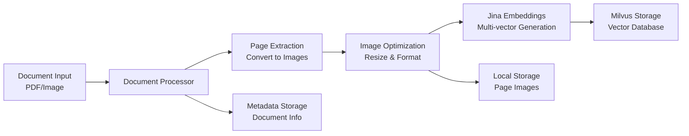
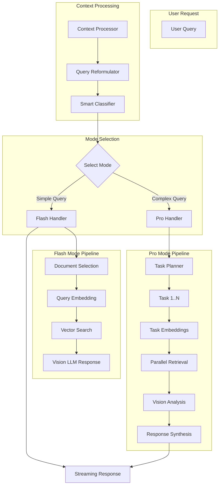
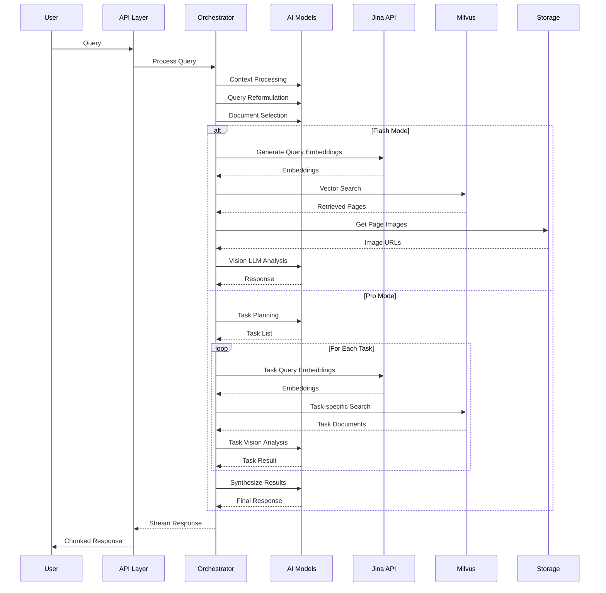

# DocPixie Backend Architecture Analysis

## Overview
DocPixie is a sophisticated multimodal RAG (Retrieval-Augmented Generation) system designed for document analysis and intelligent querying. The backend implements a multi-agent orchestration system with two primary modes: Flash (basic RAG) and Pro (complex multi-task execution).

## Core Architecture Components

### 1. Document Processing Pipeline

The document processing pipeline converts documents into searchable, AI-analyzable formats:



**Key Components:**
- **LocalDocumentProcessor**: Handles document ingestion and conversion
- **Image Processing**: Converts PDFs to images, optimizes for embedding (JPEG, quality 90)
- **Jina Integration**: Generates 1030 vectors of 128 dimensions per page
- **Batch Processing**: Processes documents in batches of 10 pages for efficiency

### 2. Vector Storage Architecture (Milvus)

The vector database schema is designed for efficient multimodal retrieval:

```
Collection Schema:
├── pk (INT64, primary key, auto-generated)
├── vector (FLOAT_VECTOR, dim=128)
├── user_id (VARCHAR)
├── space_id (VARCHAR)
├── doc_id (VARCHAR)
├── page_id (INT16)
├── seq_id (INT16) - for multi-vector embeddings
├── doc_path (VARCHAR)
├── doc_name (VARCHAR)
└── page_url (VARCHAR) - for image retrieval
```

**Indexing Strategy:**
- **Vector Index**: HNSW with Inner Product metric (optimized for Jina embeddings)
- **Scalar Indexes**: user_id, space_id, doc_id for filtering

### 3. AI Agent Orchestration System



### 4. Agent Types and Roles

#### **Core AI Agents:**

1. **Context Processor**
   - Processes conversation history
   - Maintains context across interactions
   - Extracts relevant information from previous messages

2. **Query Reformulator**
   - Enhances queries with conversation context
   - Expands abbreviated queries
   - Clarifies ambiguous references

3. **Smart Classifier**
   - Analyzes document summaries
   - Selects relevant documents for retrieval
   - Determines page-specific vs vector search strategy
   - Extracts page number references from queries

4. **Task Planner (Pro Mode)**
   - Decomposes complex queries into subtasks
   - Assigns documents to each task
   - Determines retrieval strategy per task
   - Creates 2-5 focused retrieval tasks

5. **Vision Expert (GPT-4o)**
   - Analyzes document images directly
   - Performs multimodal understanding
   - Extracts information from visual content

6. **Synthesis Agent**
   - Combines results from multiple tasks
   - Creates coherent responses
   - Maintains citation tracking

### 5. Retrieval Strategies

The system implements two retrieval strategies:

#### **Vector Search (Default)**
- Semantic similarity search using Jina embeddings
- ColBERT-style multi-vector retrieval
- Reranking for relevance optimization
- Top-K retrieval (configurable per mode)

#### **Page-Specific Retrieval**
- Direct page access when page numbers are mentioned
- Bypasses vector search for efficiency
- Returns exact pages requested by user
- Fallback to vector search if pages not found

### 6. RAG Pipeline Flow

#### **Flash Mode (Simple Queries)**
1. Query received → Context processing
2. Query reformulation with conversation history
3. Smart document selection based on summaries
4. Query embedding generation (Jina)
5. Vector search with reranking
6. Vision LLM response generation with document images
7. Streaming response to client

#### **Pro Mode (Complex Queries)**
1. Query received → Context processing
2. Query reformulation
3. Document selection
4. **Task planning** (2-5 subtasks)
5. Parallel task execution:
   - Individual query generation per task
   - Task-specific embedding and retrieval
   - Vision LLM analysis per task
6. Memory context building
7. **Response synthesis** from all task results
8. Streaming final response

### 7. Key Technical Features

#### **Multimodal Processing**
- Direct image analysis using GPT-4o vision
- Document pages passed as images to LLM
- Visual understanding of charts, tables, diagrams

#### **Embedding Architecture**
- **Model**: Jina embeddings v4 multi-vector
- **Dimensions**: 128D vectors
- **Vectors per page**: 1030
- **Storage**: ~256KB per page
- **Similarity**: Inner Product (ColBERT-style)

#### **Streaming Response**
- Real-time response generation
- Task status updates in Pro mode
- Metadata sent before content
- Chunk-based delivery for better UX

#### **Error Handling**
- Graceful fallbacks at each stage
- Page-not-found specific handling
- Document availability checks
- Task failure recovery in Pro mode

### 8. Data Flow Diagram



### 9. Configuration and Models

#### **AI Models Used:**
- **Vision Model**: GPT-4o (multimodal analysis)
- **Flash Model**: GPT-4o-mini (fast responses)
- **Task Planner**: GPT-4o (complex reasoning)
- **Embeddings**: Jina-embeddings-v4

#### **Key Parameters:**
- **Flash Mode Top-K**: Configurable (default 5-10)
- **Pro Mode Top-K**: Higher for comprehensive retrieval
- **Embedding Batch Size**: 10 pages
- **Temperature Settings**: Balanced (0.7), Creative (0.9), Moderate (0.5)
- **Max Tokens**: Standard (2000), Medium (1000)

### 10. Advanced Features

#### **Memory Management (Pro Mode)**
- AgentMemory tracks task execution
- Context accumulation across tasks
- Task status tracking (pending → in_progress → completed/failed)
- Result aggregation for synthesis

#### **Document Summary System**
- AI-generated summaries for each document
- Used for intelligent document selection
- Reduces unnecessary retrievals
- Improves query targeting

#### **Conversation Context**
- Maintains message history
- References previous interactions
- Resolves pronouns and references
- Context-aware reformulation

## System Strengths

1. **True Multimodal Understanding**: Direct image analysis preserves visual information
2. **Intelligent Orchestration**: Adaptive complexity handling via dual-mode system
3. **Efficient Retrieval**: Smart document selection reduces search space
4. **Task Decomposition**: Complex queries broken into manageable subtasks
5. **Scalable Architecture**: Batch processing and async operations throughout

## Architecture Patterns

1. **Handler Pattern**: Separate handlers for Flash and Pro modes
2. **Strategy Pattern**: Configurable retrieval strategies
3. **Pipeline Pattern**: Sequential processing stages
4. **Observer Pattern**: Streaming responses with status updates
5. **Factory Pattern**: AI model instantiation based on task type

## Deployment Considerations

- **Milvus**: Can use local Docker or managed Zilliz Cloud
- **Storage**: Local file system or cloud storage (Supabase)
- **API**: FastAPI with async/await throughout
- **Concurrency**: ThreadPoolExecutor for Milvus operations
- **Environment**: Development vs Production configurations

This architecture demonstrates a sophisticated, production-ready RAG system with advanced multimodal capabilities and intelligent agent orchestration suitable for complex document analysis tasks.