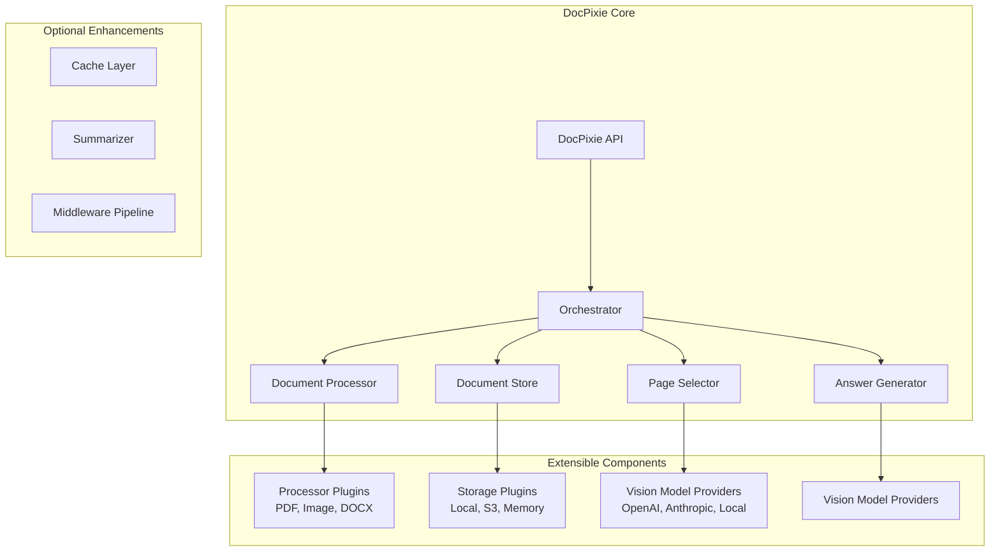

# DocPixie Open-Source Library Architecture

## Overview

DocPixie is a lightweight, extensible multimodal RAG library that enables developers to build document question-answering systems without the complexity of vector databases or embedding models. It leverages vision language models (VLMs) for both document understanding and intelligent page selection.

## Core Philosophy

- **Simplicity First**: No vector databases, no embedding models, just vision AI
- **Fully Multimodal**: Documents are processed as images, preserving all visual information
- **Extensible by Design**: Plugin architecture for providers, storage, and strategies
- **Developer Friendly**: Simple API, sensible defaults, progressive complexity

## Architecture Overview



## Component Architecture

### 1. Core Components

```python
# Core component structure
docpixie/
├── __init__.py
├── docpixie.py              # Main API class
├── core/
│   ├── __init__.py
│   ├── orchestrator.py      # Pipeline orchestration
│   ├── document.py          # Document models
│   └── interfaces.py        # Abstract base classes
├── processors/
│   ├── __init__.py
│   ├── base.py              # BaseProcessor
│   ├── pdf.py               # PDFProcessor
│   ├── image.py             # ImageProcessor
│   └── factory.py           # ProcessorFactory
├── storage/
│   ├── __init__.py
│   ├── base.py              # BaseStorage
│   ├── local.py             # LocalStorage
│   ├── memory.py            # InMemoryStorage
│   └── s3.py                # S3Storage (optional)
├── providers/
│   ├── __init__.py
│   ├── base.py              # BaseProvider (raw API interface)
│   ├── openai.py            # OpenAIProvider
│   ├── anthropic.py         # AnthropicProvider
│   └── factory.py           # ProviderFactory
├── ai/
│   ├── __init__.py
│   ├── summarizer.py        # Page/document summarization logic
│   ├── selector.py          # Page selection strategies
│   └── answering.py         # Answer generation strategies
├── middleware/
│   ├── __init__.py
│   ├── base.py              # BaseMiddleware
│   ├── cache.py             # CacheMiddleware
│   └── logging.py           # LoggingMiddleware
└── utils/
    ├── __init__.py
    ├── image.py             # Image utilities
    └── async_helpers.py     # Async/sync compatibility
```

### 2. Core Interfaces

```python
# docpixie/core/interfaces.py

from abc import ABC, abstractmethod
from typing import List, Dict, Any, Optional, AsyncGenerator
from dataclasses import dataclass

@dataclass
class Page:
    """Represents a document page"""
    page_number: int
    image_path: str
    content_summary: Optional[str] = None
    metadata: Dict[str, Any] = None

@dataclass
class Document:
    """Represents a processed document"""
    id: str
    name: str
    pages: List[Page]
    summary: Optional[str] = None
    metadata: Dict[str, Any] = None

@dataclass
class QueryResult:
    """Result of a RAG query"""
    answer: str
    selected_pages: List[Page]
    confidence: float
    metadata: Dict[str, Any] = None

class BaseProcessor(ABC):
    """Base class for document processors"""

    @abstractmethod
    async def process(self, file_path: str) -> Document:
        """Process a document file into pages"""
        pass

    @abstractmethod
    def supports(self, file_path: str) -> bool:
        """Check if processor supports this file type"""
        pass

class BaseStorage(ABC):
    """Base class for storage backends"""

    @abstractmethod
    async def save_document(self, document: Document) -> str:
        """Save a processed document"""
        pass

    @abstractmethod
    async def get_document(self, doc_id: str) -> Optional[Document]:
        """Retrieve a document by ID"""
        pass

    @abstractmethod
    async def list_documents(self) -> List[Dict[str, Any]]:
        """List all documents"""
        pass

    @abstractmethod
    async def delete_document(self, doc_id: str) -> bool:
        """Delete a document"""
        pass

class BaseProvider(ABC):
    """Base class for AI vision providers"""

    @abstractmethod
    async def process_text_messages(
        self,
        messages: List[dict],
        max_tokens: int = 300,
        temperature: float = 0.3
    ) -> str:
        """Process text-only messages through the provider API"""
        pass

    @abstractmethod
    async def process_multimodal_messages(
        self,
        messages: List[dict],
        max_tokens: int = 300,
        temperature: float = 0.3
    ) -> str:
        """Process messages with text and images through the provider API"""
        pass
```

### 3. Main API Design

```python
# docpixie/docpixie.py

from typing import Optional, List, Dict, Any, Union, AsyncGenerator
from pathlib import Path

class DocPixie:
    """Main DocPixie API class"""

    def __init__(
        self,
        provider: Union[str, BaseVisionProvider] = "openai",
        storage: Union[str, BaseStorage] = "local",
        config: Optional[DocPixieConfig] = None
    ):
        """
        Initialize DocPixie

        Args:
            provider: Vision provider name or instance
            storage: Storage backend name or instance
            config: Configuration object
        """
        self.config = config or DocPixieConfig()
        self.provider = self._init_provider(provider)
        self.storage = self._init_storage(storage)
        self.orchestrator = Orchestrator(
            provider=self.provider,
            storage=self.storage,
            config=self.config
        )

    async def add_document(
        self,
        file_path: Union[str, Path],
        document_id: Optional[str] = None,
        summarize: bool = True
    ) -> Document:
        """
        Add a document to the RAG system

        Args:
            file_path: Path to document file
            document_id: Optional custom ID
            summarize: Whether to generate page summaries

        Returns:
            Processed Document object
        """
        return await self.orchestrator.add_document(
            file_path,
            document_id,
            summarize
        )

    async def query(
        self,
        question: str,
        document_ids: Optional[List[str]] = None,
        max_pages: int = 5,
        stream: bool = False
    ) -> Union[QueryResult, AsyncGenerator[str, None]]:
        """
        Query documents with a question

        Args:
            question: User's question
            document_ids: Specific documents to search (None = all)
            max_pages: Maximum pages to use for context
            stream: Whether to stream the response

        Returns:
            QueryResult or async generator for streaming
        """
        return await self.orchestrator.query(
            question,
            document_ids,
            max_pages,
            stream
        )

    def add_middleware(self, middleware: BaseMiddleware):
        """Add middleware to the pipeline"""
        self.orchestrator.add_middleware(middleware)

    # Convenience sync methods for easier adoption
    def add_document_sync(self, file_path: str, **kwargs) -> Document:
        """Synchronous version of add_document"""
        return sync_wrapper(self.add_document(file_path, **kwargs))

    def query_sync(self, question: str, **kwargs) -> QueryResult:
        """Synchronous version of query"""
        return sync_wrapper(self.query(question, **kwargs))
```

### 4. Pipeline Orchestration

```python
# docpixie/core/orchestrator.py

class Orchestrator:
    """Manages the RAG pipeline"""

    def __init__(self, provider, storage, config):
        self.provider = provider
        self.storage = storage
        self.config = config
        self.processor_factory = ProcessorFactory()
        self.middlewares = []

    async def add_document(self, file_path, document_id, summarize):
        # 1. Select appropriate processor
        processor = self.processor_factory.get_processor(file_path)

        # 2. Process document to pages
        document = await processor.process(file_path)
        document.id = document_id or generate_id()

        # 3. Generate page summaries (optional)
        if summarize:
            for page in document.pages:
                page.content_summary = await self.provider.summarize_page(page)

            # Generate document summary from page summaries
            document.summary = await self._generate_doc_summary(document)

        # 4. Save to storage
        await self.storage.save_document(document)

        return document

    async def query(self, question, document_ids, max_pages, stream):
        # 1. Retrieve relevant documents
        documents = await self._get_documents(document_ids)

        # 2. Collect all pages
        all_pages = []
        for doc in documents:
            all_pages.extend(doc.pages)

        # 3. Smart page selection using vision model
        selected_pages = await self.provider.select_pages(
            question,
            all_pages,
            max_pages
        )

        # 4. Generate answer
        if stream:
            return self._stream_answer(question, selected_pages)
        else:
            answer_text = ""
            async for chunk in self.provider.generate_answer(
                question,
                selected_pages,
                stream=False
            ):
                answer_text += chunk

            return QueryResult(
                answer=answer_text,
                selected_pages=selected_pages,
                confidence=self._calculate_confidence(selected_pages),
                metadata={"documents_searched": len(documents)}
            )

    async def _stream_answer(self, question, pages):
        """Stream answer generation"""
        async for chunk in self.provider.generate_answer(
            question,
            pages,
            stream=True
        ):
            yield chunk
```

### 5. Provider and AI Operations Separation

The architecture maintains clean separation between raw API operations (providers) and business logic (AI operations):

```python
# docpixie/providers/openai.py - Raw API operations only

class OpenAIProvider(BaseProvider):
    """OpenAI provider for raw API operations"""

    def __init__(self, config: DocPixieConfig):
        self.client = AsyncOpenAI(api_key=config.openai_api_key)
        self.model = config.vision_model

    async def process_text_messages(
        self,
        messages: List[Dict[str, Any]],
        max_tokens: int = 300,
        temperature: float = 0.3
    ) -> str:
        """Process text-only messages through OpenAI API"""
        response = await self.client.chat.completions.create(
            model=self.config.pro_model,
            messages=messages,
            max_tokens=max_tokens,
            temperature=temperature
        )
        return response.choices[0].message.content.strip()

    async def process_multimodal_messages(
        self,
        messages: List[Dict[str, Any]],
        max_tokens: int = 300,
        temperature: float = 0.3
    ) -> str:
        """Process multimodal messages through OpenAI Vision API"""
        processed_messages = self._prepare_openai_messages(messages)

        response = await self.client.chat.completions.create(
            model=self.model,
            messages=processed_messages,
            max_tokens=max_tokens,
            temperature=temperature
        )
        return response.choices[0].message.content.strip()
```

```python
# docpixie/ai/summarizer.py - Business logic

class PageSummarizer:
    """Handles page and document summarization business logic"""

    def __init__(self, config: DocPixieConfig, provider: Optional[BaseProvider] = None):
        self.config = config
        self.provider = provider or create_provider(config)

    async def summarize_pages(self, pages: List[Page]) -> List[Page]:
        """Generate summaries for multiple pages in parallel"""
        # Business logic for batching and parallel processing
        batch_size = self.config.batch_size
        summarized_pages = []

        for i in range(0, len(pages), batch_size):
            batch = pages[i:i + batch_size]
            batch_tasks = [self._summarize_single_page(page) for page in batch]
            batch_results = await asyncio.gather(*batch_tasks, return_exceptions=True)
            # Handle results...

    async def _summarize_single_page(self, page: Page) -> Page:
        """Summarize a single page using provider"""
        # Build prompt and messages for page summary
        messages = [
            {
                "role": "system",
                "content": "You are a document analysis expert. Analyze the document page image..."
            },
            {
                "role": "user",
                "content": [
                    {"type": "text", "text": "Please analyze this document page..."},
                    {"type": "image_path", "image_path": page.image_path, "detail": "high"}
                ]
            }
        ]

        # Use provider for raw API call
        summary = await self.provider.process_multimodal_messages(
            messages=messages, max_tokens=200, temperature=0.3
        )

        # Return new page with summary
        return Page(
            page_number=page.page_number,
            image_path=page.image_path,
            content_summary=summary,
            metadata={**page.metadata, 'summary_generated': True}
        )

    async def _generate_document_summary(self, pages: List[Page], document_name: str) -> str:
        """Generate document summary using ALL page images in single call"""
        # Build messages with all page images
        messages = [
            {
                "role": "system",
                "content": "You are a document analysis expert. Analyze all pages of this document..."
            },
            {
                "role": "user",
                "content": [
                    {"type": "text", "text": f"Please analyze this complete document titled '{document_name}'..."}
                ]
            }
        ]

        # Add all page images to the user message
        for i, page in enumerate(pages):
            messages[1]["content"].append({
                "type": "image_path",
                "image_path": page.image_path,
                "detail": "high"
            })
            messages[1]["content"].append({
                "type": "text",
                "text": f"[Page {i + 1}]"
            })

        # Use provider for raw API call
        summary = await self.provider.process_multimodal_messages(
            messages=messages, max_tokens=400, temperature=0.3
        )

        return summary
```

## Usage Examples

### Basic Usage

```python
import asyncio
from docpixie import DocPixie

async def main():
    # Initialize with defaults (OpenAI provider, local storage)
    rag = DocPixie(api_key="your-openai-key")

    # Add a document
    doc = await rag.add_document("research_paper.pdf")
    print(f"Added document: {doc.name}")

    # Query the document
    result = await rag.query("What are the main findings?")
    print(f"Answer: {result.answer}")
    print(f"Used {len(result.selected_pages)} pages")

# Synchronous usage for simpler scripts
def simple_example():
    rag = DocPixie(api_key="your-openai-key")

    # Sync methods available
    doc = rag.add_document_sync("report.pdf")
    result = rag.query_sync("Summarize the conclusions")
    print(result.answer)
```

### Advanced Configuration

```python
from docpixie import DocPixie, DocPixieConfig
from docpixie.providers import AnthropicProvider
from docpixie.storage import S3Storage
from docpixie.middleware import CacheMiddleware

# Custom configuration
config = DocPixieConfig(
    max_image_size=(2048, 2048),
    jpeg_quality=95,
    page_summary_enabled=True,
    batch_size=10
)

# Use different providers and storage
provider = AnthropicProvider(api_key="claude-key", model="claude-3-opus")
storage = S3Storage(bucket="my-docs", region="us-west-2")

rag = DocPixie(
    provider=provider,
    storage=storage,
    config=config
)

# Add caching middleware
cache = CacheMiddleware(ttl=3600, max_size=100)
rag.add_middleware(cache)

# Streaming responses
async def stream_example():
    async for chunk in await rag.query(
        "Explain the methodology",
        stream=True
    ):
        print(chunk, end="", flush=True)
```

### Custom Provider Implementation

```python
from docpixie.providers import BaseProvider

class CustomProvider(BaseProvider):
    """Custom provider implementation"""

    async def process_text_messages(self, messages, max_tokens=300, temperature=0.3):
        # Your custom text processing logic
        # Could use local models, different APIs, etc.
        pass

    async def process_multimodal_messages(self, messages, max_tokens=300, temperature=0.3):
        # Your custom multimodal processing
        # Handle image_path type in messages and convert as needed
        pass

# Use custom provider
rag = DocPixie(provider=CustomProvider())
```

## Extension Points

### 1. Storage Backends
- **Local**: File system storage
- **Memory**: In-memory for testing
- **S3**: AWS S3 storage
- **Azure**: Azure Blob Storage
- **Custom**: Implement BaseStorage

### 2. Document Processors
- **PDF**: PDF to images
- **Images**: Direct image processing
- **DOCX**: Word documents
- **PPTX**: PowerPoint slides
- **Custom**: Implement BaseProcessor

### 3. AI Providers
- **OpenAI**: GPT-4V and GPT-4 models
- **Anthropic**: Claude 3 Vision and text models
- **Google**: Gemini Pro Vision
- **Local**: LLaVA, CLIP, etc.
- **Custom**: Implement BaseProvider

### 4. Middleware System
- **Caching**: Response caching
- **Logging**: Request/response logging
- **Rate Limiting**: API rate limits
- **Authentication**: Access control
- **Metrics**: Performance monitoring

### 5. Strategies
- **Page Selection**: Different selection algorithms
- **Summarization**: Various summary techniques
- **Answer Generation**: Response strategies

## Configuration

```python
@dataclass
class DocPixieConfig:
    """DocPixie configuration"""

    # Image processing
    max_image_size: Tuple[int, int] = (2048, 2048)
    jpeg_quality: int = 90
    thumbnail_size: Tuple[int, int] = (256, 256)

    # Processing
    batch_size: int = 10
    page_summary_enabled: bool = True
    doc_summary_enabled: bool = True

    # Selection
    default_max_pages: int = 5
    selection_strategy: str = "vision"  # or "summary_based"

    # Storage
    storage_path: str = "./docpixie_data"


```

## Performance Optimizations

### 1. Page Selection Optimization
- Use thumbnails for initial selection (low detail)
- Full resolution only for final answer generation
- Batch page processing

### 2. Caching Strategy
- Cache page summaries
- Cache document summaries
- Cache frequent queries
- LRU eviction policy

### 3. Async Operations
- Parallel page processing
- Concurrent summarization
- Streaming responses

## Deployment Considerations

### Package Structure
```
docpixie/
├── pyproject.toml
├── README.md
├── LICENSE
├── requirements.txt
├── setup.py
├── docpixie/
│   └── [source code]
├── examples/
│   ├── basic_usage.py
│   ├── advanced_config.py
│   └── custom_provider.py
├── tests/
│   ├── test_processors.py
│   ├── test_providers.py
│   └── test_integration.py
└── docs/
    ├── getting_started.md
    ├── api_reference.md
    └── extending.md
```

### Dependencies
```toml
[project]
name = "docpixie"
version = "0.1.0"
dependencies = [
    "Pillow>=10.0.0",
    "pdf2image>=1.16.0",
    "aiofiles>=23.0.0",
    "pydantic>=2.0.0",
    "openai>=1.0.0",  # optional
    "anthropic>=0.10.0",  # optional
    "boto3>=1.28.0",  # optional for S3
]

[project.optional-dependencies]
dev = ["pytest", "pytest-asyncio", "black", "mypy"]
openai = ["openai>=1.0.0"]
anthropic = ["anthropic>=0.10.0"]
s3 = ["boto3>=1.28.0", "aioboto3>=11.0.0"]
```

## Advantages of This Architecture

1. **No Infrastructure Dependencies**: Works out of the box without vector databases
2. **True Multimodal**: Preserves all visual information in documents
3. **Simple Mental Model**: Documents → Pages → Selection → Answer
4. **Progressive Complexity**: Start simple, add features as needed
5. **Provider Agnostic**: Easy to switch between vision models
6. **Storage Flexible**: From local files to cloud storage
7. **Extensible**: Clear interfaces for customization
8. **Production Ready**: Async support, streaming, caching

## Migration Path from Production DocPixie

For users migrating from the full DocPixie system:

1. **Document Migration**: Export documents and reprocess (no embeddings needed)
2. **API Compatibility**: Similar query interface
3. **Feature Parity**: Core RAG functionality maintained
4. **Performance**: Comparable for small-medium document sets

This architecture provides a clean, extensible foundation for building multimodal RAG applications while maintaining simplicity and ease of use.
